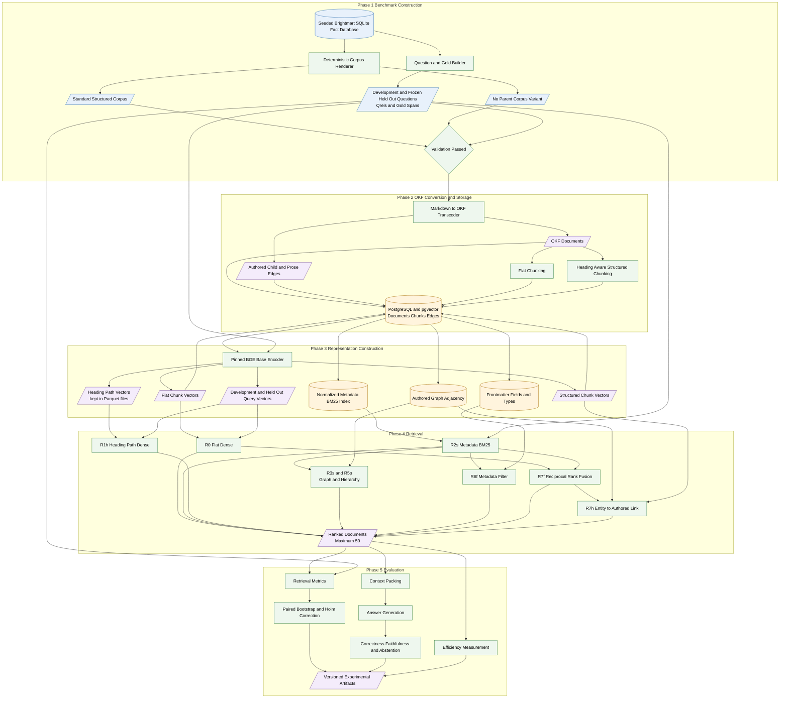
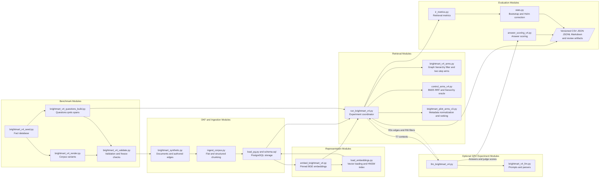
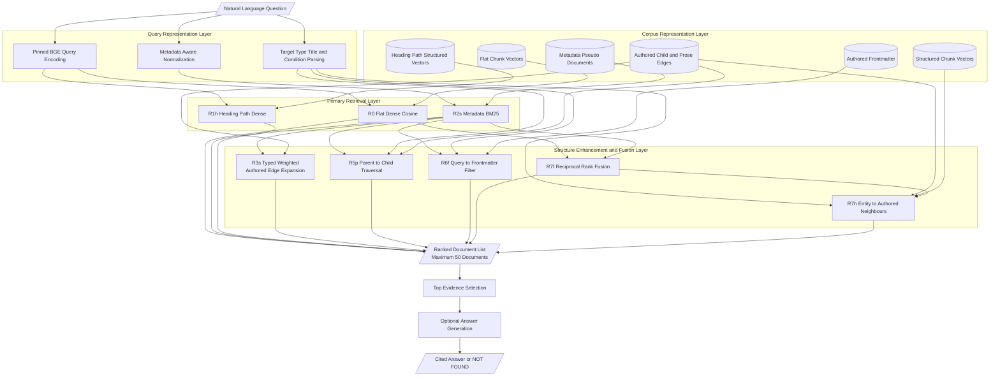
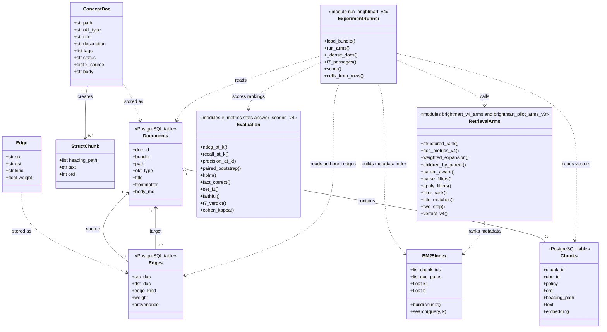
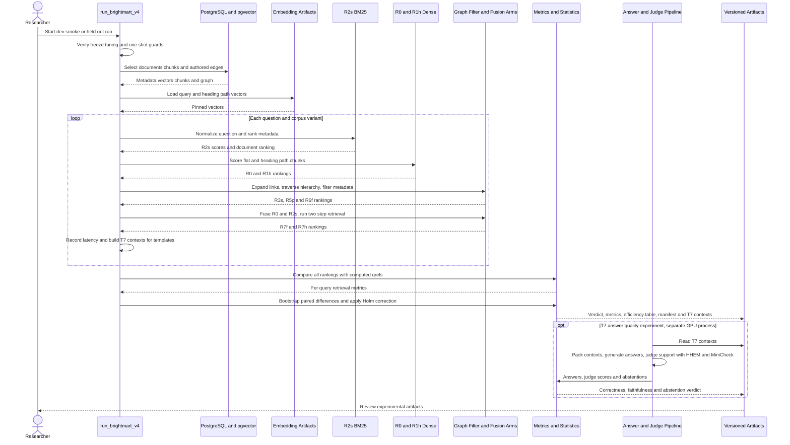
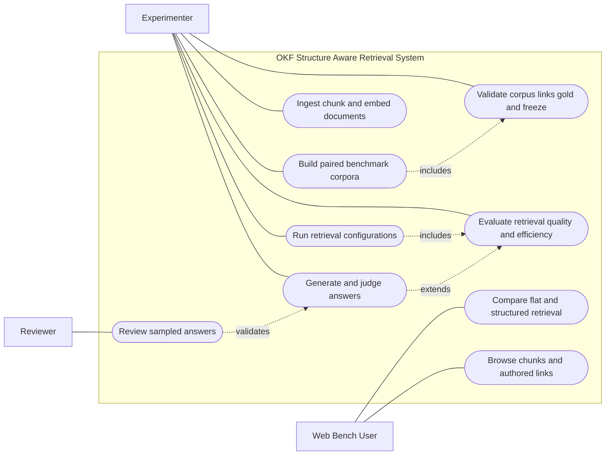
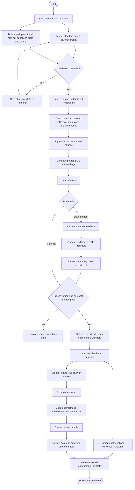

# Authored Structure Aware Retrieval with Open Knowledge Format

## Documentation and presentation source

This document defines the motivation, research gap, proposed method, system design, dataset, and evaluation protocol for a study of structure aware retrieval over Open Knowledge Format documents. It is written as a shared source for a full project report and presentation.

The study compares two representations of the same prose. The flat representation removes frontmatter, hierarchy, and link targets before fixed size chunking. The structured representation retains authored metadata, headings, parent child relationships, and document links. This paired design isolates the contribution of authored structure while keeping document content constant.

This version is complete. It contains the confirmatory held out results for tests T1 through T9, their discussion, every deviation from the preregistration, the conclusion, future work, and a verified reference list. The numbers in the results sections are taken from the archived run outputs in [`docs/brightmart_v4_results/`](docs/brightmart_v4_results/) and summarised in [`docs/brightmart_v4_results.md`](docs/brightmart_v4_results.md).

## Abstract

Retrieval Augmented Generation systems [1] commonly flatten documents into fixed size chunks and retrieve them through vector similarity. Flattening removes authored signals such as frontmatter fields, heading paths, document hierarchy, and hyperlinks. Recent structured retrieval systems [2], [4] attempt to reconstruct these signals through language model based entity extraction, relation discovery, graph construction, or summarisation. These steps add cost and extraction error, which makes it difficult to determine whether reported changes arise from structure itself or from the model that inferred it.

This project evaluates whether human authored Open Knowledge Format structure improves retrieval without changing the underlying prose. It develops and compares flat dense retrieval, multi field metadata retrieval, heading aware dense retrieval, authored graph expansion, parent aware traversal, query to metadata filtering, and training free reciprocal rank fusion. The Brightmart v4 benchmark contains paired standard and no parent corpus variants, disjoint development and frozen held out questions, computed gold evidence, paraphrases, difficult near duplicate documents, and unanswerable questions. The evaluation measures retrieval quality, answer correctness, faithfulness, abstention, and computational efficiency under one preregistered protocol.

On the frozen held out set, metadata retrieval over authored structure improves nDCG@10 over flat dense retrieval by 0.291 on set and hierarchy questions (95% CI 0.202 to 0.380), with 70 percent of the gain retained under paraphrase. Parent aware traversal recovers hierarchy questions when child documents do not name their parent (+0.735), frontmatter filters resolve numeric and date conditions (+0.783), and an entity to authored link step keeps two hop quality above the flat baseline. Language model extracted links perform no better than authored links while costing about 0.97 million model tokens to build. Answers generated from structure aware contexts are more correct (answer F1 +0.146) but not more often judged faithful, because the delivered text can omit the metadata that selected a document.

## Limitations of Existing Approaches

The quantitative comparisons in this section come from the project literature survey. Each figure is cited to its source paper and was checked against that paper.

### Dataset and benchmark limitations

1. **Human authored structure is not isolated.** Existing benchmarks do not compare authored metadata, hierarchy, and links with a flat representation of identical prose. News and Wikipedia collections expose implicit links, while Freebase based knowledge graph question answering sets [11] contain curated entity triples rather than authored documents.
2. **Evaluation evidence is often synthetic or small.** LiHuaWorld uses GPT 4 generated evaluation data [3], the UltraDomain questions are generated from simulated users and tasks [4], NodeRAG evaluates on samples of 175 to 375 questions per dataset [5], and Multi Meta RAG reports its gains on a single news benchmark [6].
3. **Domain and language coverage is narrow.** Existing studies concentrate on news [6], earnings call transcripts [9], long narrative and fiction collections [8], and Freebase derived question answering [11]. Most are English only; DAT [7] is an exception, evaluating on the Traditional Chinese DRCD set alongside SQuAD. Technical documentation is not represented as a primary benchmark domain.

### Algorithm and model limitations

1. **Structural benefit is confounded with extraction quality.** Most systems infer entities and relations with a language model. A measured gain or loss therefore combines the value of structure with extraction error. Reported performance changes materially when the graph extractor changes, including from GPT 4o to GPT 4o mini [8].
2. **Entity first retrieval can miss factual evidence.** An incomplete extracted graph weakens recall: only about 65.8 percent of answer entities appear in the constructed knowledge graph for HotpotQA and 65.5 percent for Natural Questions [8].
3. **Redundant context drives cost.** GraphRAG needs about 610,000 retrieval tokens per query on the UltraDomain Legal set, against fewer than 100 for LightRAG [4]. NodeRAG scores higher on HotpotQA with 5.0 thousand retrieved tokens than GraphRAG with 6.6 thousand [5]. Retrieving more context therefore does not guarantee better evidence coverage.
4. **Fusion is either simple or costly to adapt.** HybridRAG concatenates the retrieved contexts [9], Blended RAG relies on hybrid query engineering [10], and DAT adds a language model call to each query [7]. SubgraphRAG [11], G Retriever [12], StructRAG [13], and the metadata probe of [14] require task specific training.
5. **Structural indexing retains an extraction cost floor.** On MultiHop RAG, knowledge graph construction takes 7,702 seconds against 135 seconds for plain RAG indexing [8], and an incremental GraphRAG update can require about seven million model tokens [4]. Efficiency improvements reduce this cost but do not remove it.

### Comparison of approach families

| Approach family | Structural source | Main retrieval mechanism | Main limitation addressed by this study |
|---|---|---|---|
| Conventional dense RAG [1] | None after flattening | Vector similarity over fixed size chunks | Loses metadata, hierarchy, headings, and authored relationships |
| GraphRAG [2] and KG GraphRAG [8] | Model extracted entities and relations | Entity seeding followed by graph traversal | Extraction cost and incomplete graphs are mixed with structural benefit |
| LightRAG [4] and NodeRAG [5] | Model extracted graph with efficiency controls | Graph and lexical retrieval with smaller contexts | Still depends on inferred structure and extractor quality |
| HybridRAG [9] and Blended RAG [10] | Dense and sparse signals | Concatenation or query engineering | Fusion is not a principled training free rank policy |
| DAT [7] and trained graph retrievers [11], [12], [13] | Adaptive or learned structure use | Per query model selection or supervised retrieval | Requires a model call, training data, or both |
| Proposed OKF retrieval | Authored metadata, hierarchy, headings, and links | Metadata ranking, traversal, filtering, dense retrieval, and reciprocal rank fusion [16] | Directly measures authored structure without requiring extraction for the primary path |

## Research Gap

The reviewed literature leaves six connected gaps.

1. No controlled benchmark isolates authored document structure from prose by comparing structured and flat versions of the same documents.
2. The extraction free cost floor of structural retrieval remains unmeasured because existing systems first infer entities, relations, or summaries.
3. Reported factual recall losses cannot be separated from extraction error when structure and the extractor change together.
4. Metadata retrieval has not been evaluated as a normalized multi field authored ranking signal across a controlled document corpus.
5. Metadata ranking, authored graph traversal, and dense similarity have not been combined through a principled training free fusion policy under one evaluation.
6. Retrieval effectiveness, efficiency, answer faithfulness, direct factual behaviour, and abstention on unanswerable questions are rarely reported together on the same corpus.

## Problem Statement

Retrieval Augmented Generation usually converts documents into fixed size chunks and ranks them by vector similarity. This process discards authored signals such as headings, frontmatter metadata, hierarchy, and hyperlinks. Structured retrieval methods reconstruct some of these signals through model based entity extraction, relation discovery, or summarisation. The reconstruction process adds cost, introduces non deterministic extraction errors, and can reduce factual recall when relevant evidence is missing from the inferred graph.

Published comparisons generally change both the document representation and the extraction pipeline. They therefore cannot determine whether a performance change comes from useful structure or from the system that inferred it. The unresolved problem is to measure the retrieval value and operational cost of structure that already exists in documents.

This study evaluates whether human authored OKF structure can improve retrieval quality and efficiency without degrading direct factual retrieval. It compares dense, metadata, heading aware, graph, filter based, and reciprocal rank fusion methods under one protocol using paired flat and structured representations of identical prose.

## Research Questions

1. Does retrieval over authored metadata improve ranking quality for set valued and hierarchy dependent questions compared with flat dense retrieval?
2. Can authored parent child and prose links support hierarchy and multi hop retrieval when parent information is absent from child metadata?
3. How does authored graph retrieval compare with the same retrieval algorithm over language model extracted edges?
4. Can training free fusion preserve dense retrieval quality on direct and two hop questions while retaining gains from structure dependent retrieval?
5. Do retrieval changes improve generated answer correctness and faithfulness while maintaining abstention on unanswerable questions?
6. What trade offs appear among ranking quality, context size, index construction, query latency, answer quality, and model token cost?

## Objectives

1. Develop dense vector, metadata based, heading aware, graph based, filter based, and hybrid retrieval methods for Open Knowledge Format documents.
2. Use OKF authored metadata, headings, document links, and hierarchy as retrieval signals.
3. Evaluate retrieval quality, answer correctness, faithfulness, abstention, and efficiency against a conventional flat dense retrieval baseline.
4. Analyse the trade offs among retrieval accuracy, computational cost, context volume, and factual reliability using a controlled OKF benchmark.

### Objective and phase alignment

| Objective | Project phase | Main evidence produced |
|---|---|---|
| Develop retrieval methods | Representation and retrieval | Comparable rankings from R0, R2s, R1h, R3s, R3x, R5p, R6f, R6l, R7f, and R7h |
| Use authored OKF structure | Transcoding, indexing, and traversal | Metadata pseudo documents, heading paths, child edges, prose edges, and frontmatter filters |
| Evaluate against flat RAG | Evaluation | Ranking metrics, answer scores, abstention rates, confidence intervals, and corrected significance tests |
| Analyse quality and cost | Evaluation and reporting | Build time, index size, query latency, context tokens, model tokens, and quality measures |

## Scope

The completed study covers Brightmart v4 tests T1 through T9, all of which were completed on the frozen held out set. It uses one English language synthetic retail documentation corpus with standard and no parent variants. T10, evaluation on real documentation corpora, is outside the current implementation.

The primary comparison is retrieval over paired representations of identical prose. The study does not train a new neural network. It uses pinned pretrained encoders and generators where a neural model is required, while the proposed retrieval logic remains deterministic and training free.

## Proposed Method

### Method overview

The method has five phases.

1. **Benchmark construction** creates a deterministic corpus, questions, relevance judgements, answer spans, and SQL derived gold sets from one seeded fact database.
2. **OKF conversion and storage** converts Markdown into OKF documents and authored edges, then creates paired flat and structured chunks in PostgreSQL with pgvector.
3. **Representation construction** builds dense vectors, metadata pseudo documents, heading path representations, graph adjacency, and typed frontmatter views.
4. **Retrieval** runs independent dense, metadata, graph, hierarchy, filtering, and hybrid configurations without access to gold evidence.
5. **Evaluation** measures ranking quality, answer behaviour, statistical uncertainty, and operational cost.

### System architecture diagram

**Figure caption:** Architecture of the proposed OKF structure aware retrieval framework, showing benchmark construction, paired document representations, retrieval configurations, and evaluated outputs.

### Architecture component explanation

#### Benchmark construction

A seeded SQLite database is the single source of factual content. The renderer produces the standard corpus and the no parent variant. The question builder derives questions, relevance judgements, answer spans, and set valued gold from the same database and rendered documents. Validation checks document identity, parent chains, authored links, question gold, and frozen held out fingerprints.

#### OKF conversion and storage

The transcode stage parses frontmatter and document bodies into OKF document records. A declared parent creates an authored `child` edge, while a Markdown body link creates an authored `prose` edge. The ingest stage stores documents, edges, and two chunk policies. Flat chunks remove structural fields and use the conventional fixed size representation. Structured chunks preserve heading paths and structural columns.

#### Representation construction

The pinned BAAI BGE base encoder [17] produces normalized vectors for flat chunks, structured chunks, heading path contextual chunks, and questions. Flat and structured chunk vectors are loaded into PostgreSQL with pgvector [24]; heading path vectors and query vectors stay in versioned Parquet files. Metadata from each document becomes one normalized BM25 [15] pseudo document. Authored edges become an adjacency graph. Frontmatter values and inferred field types support deterministic categorical, Boolean, numeric, and date filters.

#### Retrieval

Each configuration returns an independent document ranking of up to 50 documents. R0 provides the flat dense baseline. R2s ranks normalized authored metadata. R1h retrieves heading path contextual chunks. R3s expands metadata ranked seeds over authored edges. R5p resolves a named parent and follows child links. R6f parses structured conditions and places matching documents first. R7f combines dense and metadata rankings through reciprocal rank fusion. R7h resolves named entities, traverses authored neighbours, and orders them by dense similarity.

#### Evaluation

Rankings are compared with computed relevance judgements. Retrieval evaluation reports nDCG, recall, precision, mean reciprocal rank, and set F1. Paired bootstrap confidence intervals and Holm correction support confirmatory comparisons. The answer experiment packs equal budget contexts for the flat and structured lanes, uses one generator and prompt, and measures correctness, faithfulness, and abstention. Efficiency evaluation records build time, index size, query latency, context tokens, and index time model tokens.

## Module Connectivity Diagram

**Figure caption:** Module connectivity for deterministic corpus generation, OKF ingest, embedding, retrieval, answer generation, and evaluation.

### Module connectivity explanation

The benchmark modules produce and validate every input before retrieval begins. The OKF and ingest modules convert validated documents into stored documents, flat chunks, structured chunks, and authored edges. Representation modules compute pinned vectors and load them against the current chunk identifiers. Retrieval modules read the database without modifying it and execute the preregistered configurations. Optional GPU modules generate extracted graph controls, language model filters, answers, and judge scores. Evaluation modules calculate retrieval metrics, statistical comparisons, answer measures, and reproducibility manifests.

The required execution order is render and validate, transcode and ingest, embed, load vectors, run the GPU graph extraction and filter steps, retrieve and evaluate, then generate, judge, and score answers. A reingest changes chunk identifiers, so embeddings must be regenerated and reloaded before another run. The complete sequence is automated in [`notebooks/okf_v4_kaggle_full_run.ipynb`](notebooks/okf_v4_kaggle_full_run.ipynb).

## Proposed Model Architecture

The proposed model is a deterministic training free retrieval ensemble. It is not a custom neural network. The BGE encoder and optional language models are pretrained and pinned; the contribution lies in how authored document structure is represented, retrieved, traversed, filtered, and fused.

**Figure caption:** Layered architecture of the proposed retrieval model from question representation to ranked evidence and optional answer generation.

### Layer and component explanation

#### Input layer

The system accepts a natural language question. The retrievers receive no gold document identifier, reference answer, answer span, or relevance judgement.

#### Query representation layer

The question is transformed in three ways. Metadata aware normalization gives the question the same token treatment as the metadata pseudo documents: lower casing, underscores split into separate words, and light plural stemming. The pinned BGE encoder creates a dense query vector with the BGE query instruction prefix. Deterministic parsing identifies the requested document type, named parent or entity, and categorical, Boolean, numeric, or date conditions.

#### Corpus representation layer

Flat chunk vectors represent the conventional baseline. Heading path vectors prepend the section heading path, without the page title, to structured chunk text. Structured chunk vectors embed the heading aligned chunks as written and supply the dense similarity that R7h uses to order neighbours. Metadata pseudo documents combine title, description, tags, type, status, and every frontmatter field, with field names split into words and Boolean values written as yes or no. Raw frontmatter supports exact filters. Authored child and prose edges represent hierarchy and document relationships.

#### Primary retrieval layer

R0 calculates cosine similarity between the question vector and flat chunk vectors, then collapses chunks to documents by first occurrence. R2s uses BM25 over one normalized metadata pseudo document per page. R1h applies dense retrieval to heading path contextual chunks.

#### Structure enhancement and fusion layer

R3s starts from the top five R2s seeds, normalises their scores by the maximum, and adds to each neighbouring document the best single seed's boost, 0.25 times the edge type weight (child 1.0, prose 0.6) times the seed score. R5p resolves a parent named in the question and, when the question asks for that parent's child type, returns its children ordered by R2s score before the R2s fallback. R6f parses conditions into frontmatter filters and places matching documents ahead of the R2s fallback. R7f applies reciprocal rank fusion [16] to R0 and R2s with the development selected constant k = 30. R7h resolves up to three named documents, follows authored links, orders neighbours by dense similarity, and falls back to the fused ranking.

#### Output layer

Every configuration produces an ordered list of at most 50 documents. Retrieval metrics use this list directly. The answer experiment takes the top ten flat chunks for R0 and the structured chunks of the top ten R2s documents, lead sections first, packs each to the same 2,048 token limit, and sends both lanes through the same answer generator and prompt. The prompt instructs the generator to reply `NOT FOUND` when the documentation does not establish the answer.

**Data flow:** Question to query representations to dense and metadata retrieval to authored structure traversal or filtering to rank fusion to ranked documents to evidence context to optional answer.

## Class Diagram

**Figure caption:** Main document, edge, chunk, retrieval, and evaluation structures and their storage relationships.

### Class diagram explanation

`ConceptDoc`, `Edge`, `StructChunk`, and `BM25Index` are implemented Python classes. `ExperimentRunner`, `RetrievalArms`, and `Evaluation` are shown as UML modules because the implementation uses focused functions rather than wrapper classes: the runner loads documents, chunk vectors, and authored edges read only, computes the dense rankings with matrix products, and calls the retrieval functions; the evaluation functions receive rankings and gold only after retrieval is complete. The database tables persist documents, chunks, and edges. The pilot study's `DenseRetriever` and `EdgeSet` classes remain in the repository but are not used by the v4 run.

## Sequence Diagram

**Figure caption:** Sequence of a v4 experiment from guarded startup through per question retrieval, evaluation, and optional answer scoring.

### Sequence explanation

The experiment runner first checks the corpus freeze, held out hashes, tuning file, and one shot output guard. It reads documents, chunks, vectors, and authored edges using read only database queries. For each question it runs metadata ranking, dense retrieval, structural enhancement, filtering, and fusion in sequence, and records each configuration's latency. Gold relevance data enters only at the scoring step after all rankings exist. The answer phase runs afterwards as a separate GPU process that reads the saved contexts and uses the same generator, prompt, and context budget for both retrieval lanes.

## Use Case Diagram

**Figure caption:** Use cases for the experimenter, the reviewer, and the interactive web bench user.

### Use case explanation

The experimenter controls benchmark construction, validation, ingest, retrieval runs, and automated evaluation. The reviewer assesses a stratified sample of questions, gold, and generated answers; in this study the project author reviewed the sample. A web bench user can submit one question to the flat and structured lanes, compare the retrieved evidence and generated answers, and browse document chunks and authored links. The web bench serves the pilot corpus (`synthetic_retail_pilot`, 53 documents); its structured lane uses the same R2s ranking as the v4 study.

## Activity Diagram

**Figure caption:** Controlled experimental activity from deterministic data construction to versioned evaluation artifacts.

### Activity explanation

Validation failure returns the process to the source data or renderer. A successful validation freezes the corpus and held out fingerprints before indexing. Development runs may select only the preregistered development parameters. The smoke path checks held out execution logic using development questions. A held out run proceeds only when the freeze, tuning, stale vector, and one shot guards pass; the GPU steps that produce the extracted edge set (R3x) and the language model filters (R6l) run before it. Retrieval, answer generation and judging, the review of a stratified sample, and efficiency measurement then produce versioned artifacts.

## Dataset Details

### Brightmart v4 corpus

Brightmart v4 is a deterministic synthetic retail documentation corpus built to compare flat and structure aware retrieval under controlled conditions. A seeded database with seed `20260924` generates every factual statement, structural field, hierarchy relation, and authored link.

| Document type | Count |
|---|---:|
| Home page | 1 |
| Region pages | 8 |
| Store profiles | 96 |
| Store sales reports | 96 |
| Department pages | 15 |
| Category pages | 60 |
| Supplier pages | 25 |
| Promotion pages | 20 |
| Policy pages | 10 |
| Archive or draft near duplicates | 16 |
| Schema page | 1 |
| **Total** | **348** |

### Corpus variants

| Variant | Structural condition | Purpose |
|---|---|---|
| Standard corpus | Retains authored frontmatter, parent information, headings, hierarchy, and document links | Main evaluation for T1 and T3 through T7 |
| No parent corpus | Removes the region field and region tag from store metadata, the store's link back to its region, the department field and department tag from category metadata, and the category's "part of the department" sentence, while retaining the authored parent links and the parent pages' child lists | Forces hierarchy questions to use authored traversal in T2 |

The two variants share every path and every other sentence, so the qrels are identical across them. Both corpora are rendered deterministically into `results/corpus_v4` and `results/corpus_v4_noparent` rather than committed, because their file names repeat the pilot corpus and each other; their SHA-256 hashes are frozen in [`configs/brightmart_v4_freeze.json`](configs/brightmart_v4_freeze.json).

### Question sets

The experiment uses disjoint development and frozen held out sets. Each set contains 200 base questions and 200 paraphrases. Each stratum contains 40 base questions.

| Stratum | Question type | Evaluation purpose |
|---|---|---|
| S1 | Direct factual | Retrieve a precise fact from one document and resist stale or look alike distractors |
| S2 | Two hop | Retrieve evidence across two related document types |
| S3 | Metadata set | Retrieve sets defined by categorical, Boolean, numeric, or date conditions |
| S4 | Hierarchy set | Retrieve children through parent child organisation |
| S5 | Unanswerable | Measure abstention and false answer behaviour when the requested term is absent |

Paraphrases preserve each question's answer and gold while changing its wording. The held out files and both corpus hashes were frozen on 2026-09-27, before any retrieval configuration was implemented or run. Within S3, 20 of the 40 base questions carry numeric or date conditions and form the T3 subset.

### Gold construction and validation

Answers, relevant documents, spans, and sets are computed from SQL and the rendered documents. They are never typed as free form gold. The validator re-executes set queries, verifies that direct and two hop answer spans exist in rendered bodies, confirms that unanswerable terms are absent from both variants, checks parent resolution and links, rejects digits or entity names in filler prose, confirms that the files on disk equal a fresh render, and checks the corpus and held out hashes against the freeze file.

### Difficulty controls

The corpus includes archive and draft pages with stale values, look alike entity names, varied store status, and independently sampled store format and opening year. These controls test whether a retriever selects current and structurally appropriate evidence rather than a lexically similar distractor.

## Retrieval Configurations

Every configuration returns up to 50 ranked documents. Dense representations use the pinned `BAAI/bge-base-en-v1.5` model on CPU. No retriever receives gold evidence.

| Identifier | Method | Role in the study |
|---|---|---|
| R0 | Dense cosine retrieval over flat chunks | Conventional RAG baseline |
| R2s | BM25 over normalized multi field metadata pseudo documents | Main authored metadata method |
| R1h | Dense retrieval over heading path contextual chunks | Tests authored section context |
| R3s | Expansion from the top five R2s seeds over authored edges, best single seed boost weighted by edge type (λ = 0.25) | Tests authored links |
| R3x | The R3s algorithm over language model extracted edges | Isolates authored and extracted structure |
| R5p | Parent aware traversal through authored child edges | Tests explicit hierarchy navigation |
| R6f | Rule based question to frontmatter filtering followed by metadata ranking | Handles categorical, Boolean, numeric, and date constraints |
| R6l | Language model produced metadata filters | Exploratory alternative to R6f |
| R7f | Reciprocal rank fusion of R2s and R0 (k = 30, chosen on the development set) | Combines metadata and dense evidence without training |
| R7h | Entity resolution, authored neighbour traversal, and fused fallback | Supports multi hop retrieval |
| `C_hier_oracle` | Gold parent hierarchy oracle | Capability ceiling excluded from all verdicts |

## Experimental Design

### Test plan

| Test | Purpose | Evaluation design |
|---|---|---|
| T1 Scale | Determine whether structural retrieval remains effective with 348 documents | Compare R2s and the extended structure aware family with R0 on 80 held out S3 and S4 questions and their paraphrases |
| T2 Hierarchy without copied parent fields | Test hierarchy traversal when child metadata does not reveal the parent | Compare R5p, R2s, and R0 on 40 S4 questions in the no parent corpus and report the oracle ceiling |
| T3 Numeric and date conditions | Test structured filtering for ranges, thresholds, and dates | Compare R6f with R0 and R2s on 20 numeric or date S3 questions and evaluate R6l separately |
| T4 Multi hop fusion | Preserve dense quality on S2 while retaining structural value on S3 and S4 | Evaluate R7f and R7h against R0 across both question groups |
| T5 Contextual chunks and link expansion | Measure the contribution of heading context and authored edges | Compare R1h and R3s with R0 on S3 and S4 |
| T6 Authored and extracted structure | Separate structural value from language model extraction noise | Run identical link expansion with authored and Qwen3-4B extracted edges and compare retrieval, edge agreement, time, and tokens |
| T7 Answer quality and faithfulness | Determine whether retrieval changes produce better grounded answers | Generate answers from R0 and R2s contexts with the same model, prompt, and 2,048 token budget and score correctness, faithfulness, and S5 abstention |
| T8 Human review | Validate gold data and automated answer judgements | Two reviewers independently assess a 20 percent stratified sample and Cohen's kappa is computed (carried out by one reviewer, the project author; deviation D1) |
| T9 Efficiency | Measure the operational cost of every configuration | Record index build time, index size, p50 and p95 query latency, answer context tokens, and index time model tokens |

### Retrieval metrics

The primary metric is normalized discounted cumulative gain at rank 10 [21] with binary relevance. Recall at 50, set level F1 at 10, precision at 10, precision at 1, and mean reciprocal rank at 10 are reported alongside it. These measures cover ordered relevance, large answer sets, early precision, and first relevant result position.

### Statistical protocol

Confirmatory comparisons use 10,000 paired bootstrap resamples [22] with seed 7 and 95 percent percentile confidence intervals. Holm correction [23] controls the family wise error rate at alpha 0.05 within each preregistered comparison family. Frozen held out templates form the confirmatory set, while their paraphrases test robustness to wording changes.

### Answer evaluation

T7 compares R0 and R2s using identical answer generation conditions. R0 contributes its top ten flat chunks. R2s contributes the structured chunks of its top ten documents with lead sections first. Each context is packed to 2,048 tokens and sent to the same pinned generator, Qwen3-4B-Instruct-2507 [18], with greedy decoding, 256 new tokens, and the same prompt. Direct and two hop answers use normalized reference containment. Set valued answers use entity set F1. HHEM 2.1 [19] supplies the primary faithfulness score: an answer is faithful when its score is at least 0.5 against the delivered context, and an abstention counts as faithful. MiniCheck 7B [20] provides a secondary, sentence level support score, and `NOT FOUND` marks abstention.

### Human review

The protocol calls for two reviewers to examine a 20 percent stratified held out sample, eight template items from each stratum, independently. They assess the question, gold evidence, generated answers, correctness, support, and abstention, and Cohen's kappa measures agreement for each judgement column. A discovered gold error requires a versioned correction and rerun. In this study the sample was reviewed by the project author, who checked the gold evidence and every generated answer and found no errors. With a single reviewer, Cohen's kappa between reviewers was not computed (deviation D1 in the Deviations section).

### Efficiency evaluation

T9 records index build time, index size, query latency at the 50th and 95th percentiles, context tokens per answer, and index time language model tokens. Authored structure has zero extraction tokens. R3x and R6l separately expose the cost of extracted edges and language model produced filters.

### Reproducibility controls

- Seed `20260924` controls data generation.
- Bootstrap seed 7 controls confidence interval resampling.
- Model checkpoints and revisions are pinned in [`configs/models.lock`](configs/models.lock).
- Held out files and corpus hashes are frozen in [`configs/brightmart_v4_freeze.json`](configs/brightmart_v4_freeze.json).
- The development selected reciprocal rank fusion constant is frozen in [`configs/brightmart_v4_tuning.json`](configs/brightmart_v4_tuning.json).
- The run script refuses stale vectors, altered held out inputs, missing tuning data, and overwrite of an existing held out verdict.
- Retrieval and evaluation read from PostgreSQL without modifying it.
- Run manifests record input hashes, model revisions, row counts, and output provenance.
- BM25 sums term scores in sorted term order, so rankings do not depend on Python's per process hash seed.
- HHEM 2.1 is loaded from its pinned weights as a T5 token classifier and reproduces its model card reference scores exactly.
- The confirmatory run was executed on Kaggle (two NVIDIA T4 GPUs), and the MiniCheck judge on AWS (one NVIDIA A10G). The Kaggle development run reproduced the local development run: 5,161 of 5,200 rankings were identical and every summary metric matched to four decimals.

## Results

All results in this section come from the single confirmatory run on the frozen held out set. Unless stated otherwise, values are nDCG@10 means over held out template questions, differences are against flat dense retrieval (R0), and intervals are paired bootstrap 95 percent confidence intervals.

### Verdict summary

| Test | Preregistered question | Outcome |
|---|---|---|
| T1 Scale | Does R2s beat R0 on S3 and S4 at 348 documents? | **Pass.** +0.291 [+0.202, +0.380], Holm significant; paraphrases +0.204 [+0.091, +0.316], 70 percent of the template gain |
| T2 Hierarchy without parent names | Does R5p beat R0 on S4 in the no parent corpus? | **Pass.** +0.735 [+0.640, +0.822], Holm significant |
| T3 Numeric and date conditions | Does R6f beat both R0 and R2s on the 20 numeric and date S3 items? | **Pass.** +0.783 [+0.678, +0.877] over R0 and +0.765 [+0.654, +0.862] over R2s, both Holm significant |
| T4 Multi hop fusion | Does a fusion variant stay within 0.05 of R0 on S2 while keeping a significant S3 and S4 gain? | **Pass through R7h.** S2 +0.108 [+0.058, +0.159]; S3 and S4 +0.167 [+0.092, +0.237]. R7f fails the S2 condition (lower bound −0.096) |
| T5 Contextual chunks and link expansion | Is each variant's S3 and S4 lower bound above zero? | R3s **kept**, +0.253 [+0.167, +0.338]; R1h **not kept**, −0.019 [−0.081, +0.041] |
| T6 Authored and extracted structure | Authored minus extracted edges under the same expansion | No difference: −0.001 [−0.018, +0.017] on S3 and S4, +0.001 [−0.008, +0.011] on S1 to S4 |
| T7 Answer quality | More correct and more often faithful on S3 and S4, with S5 abstention not lower? | **Fail.** Answer F1 +0.146 [+0.074, +0.219], but faithfulness −0.100 [−0.212, +0.013] |
| T8 Human review | Cohen's kappa of at least 0.7 between two reviewers | **Completed by human review.** The project author found no errors in the 40 gold items or the 80 answer judgements; the automatic scoring agreed with the review on all 80 judgements. One reviewer instead of two (deviation D1) |
| T9 Efficiency | Cost of every configuration | Reported in the efficiency table |

The main comparison family on S3 and S4 templates (n = 80) gives, against R0: R2s +0.291, R3s +0.253, R5p +0.400, R6f +0.722, R7f +0.283, and R7h +0.167, all Holm significant, and R1h −0.019, not significant.

### Retrieval quality by stratum

| Stratum | R0 | R2s | R1h | R3s | R3x | R5p | R6f | R6l | R7f | R7h |
|---|---|---|---|---|---|---|---|---|---|---|
| S1 direct fact | **0.960** | 0.761 | **0.963** | 0.783 | 0.775 | 0.761 | 0.761 | 0.710 | 0.932 | 0.950 |
| S2 two hop | 0.845 | 0.661 | 0.820 | 0.798 | 0.799 | 0.661 | 0.661 | 0.565 | 0.811 | **0.954** |
| S3 metadata set | 0.251 | 0.448 | 0.260 | 0.418 | 0.410 | 0.471 | **1.000** | 0.929 | 0.463 | 0.434 |
| S3 numeric and date subset | 0.217 | 0.235 | 0.216 | 0.189 | 0.216 | 0.235 | **1.000** | 0.990 | 0.335 | 0.335 |
| S4 hierarchy set | 0.281 | 0.667 | 0.235 | 0.619 | 0.628 | 0.861 | 0.975 | **0.988** | 0.634 | 0.432 |

In the no parent corpus, S4 scores are R0 0.143, R2s 0.442, R3s 0.540, R5p 0.878, and R6f 0.661. The hierarchy oracle, which is handed the gold parent and returns all of its children, reaches 0.792 on both corpora; R5p and R6f exceed it because many S4 items add a further condition, such as a pharmacy or an opening year, that the oracle ignores.

Pooled S3 and S4 templates, with the set size metrics:

| Configuration | nDCG@10 | Recall@50 | F1@10 |
|---|---|---|---|
| R0 flat dense | 0.266 | 0.720 | 0.199 |
| R2s metadata | 0.557 | 0.910 | 0.460 |
| R1h heading path dense | 0.247 | 0.714 | 0.207 |
| R3s authored link expansion | 0.518 | 0.901 | 0.429 |
| R3x extracted link expansion | 0.519 | 0.895 | 0.432 |
| R5p parent aware | 0.666 | 0.910 | 0.520 |
| R6f rule based filter | 0.988 | 0.991 | 0.712 |
| R6l language model filter | 0.959 | 0.989 | 0.698 |
| R7f reciprocal rank fusion | 0.548 | 0.890 | 0.439 |
| R7h two step | 0.433 | 0.850 | 0.368 |

On direct facts (S1), every configuration that ranks only metadata loses to R0 (R2s −0.199 [−0.257, −0.140]), while the configurations that keep dense evidence do not (R7f −0.028 [−0.062, +0.000], R7h −0.010 [−0.075, +0.049], R1h +0.003).

### Authored and extracted structure (T6)

Qwen3-4B-Instruct-2507 extracted 3,101 edges from the 348 standard corpus pages, using 948,702 prompt tokens and 19,765 completion tokens (968,467 in total) in 1,984 seconds on two T4 GPUs. As undirected document pairs, the extracted graph has 2,792 pairs against 1,383 authored pairs, of which 836 are shared: precision 0.30 and recall 0.60 against the authored links. With the same R3s expansion, the two edge sets produce the same retrieval quality.

### Answer quality (T7)

| S3 and S4 held out templates (n = 80) | R0 context | R2s context | Difference [95% CI] |
|---|---|---|---|
| Answer set F1 | 0.518 | 0.663 | +0.146 [+0.074, +0.219] |
| Faithful, HHEM ≥ 0.5 (primary) | 0.863 | 0.762 | −0.100 [−0.212, +0.013] |
| Faithful, MiniCheck (secondary) | 0.650 | 0.550 | −0.100 [−0.237, +0.037] |
| S1 and S2 correct (n = 80) | 0.800 | 0.725 | −0.075 [−0.200, +0.050] |
| S5 abstention (n = 40) | 0.875 | 0.900 | +0.025 [−0.050, +0.100] |
| Mean context tokens | 1,560 | 1,788 | |

### Review of the stratified sample (T8)

The project author reviewed the 40 sampled held out templates and their 80 answers against fixed rules: S1 and S2 answers must state the gold fact, and the group rather than only the department for group questions; S3 and S4 answers must name every gold entity and no wrong one; S5 answers must decline. All 40 gold answers were confirmed correct, and no errors were found in the answer judgements. Answers were correct for R0 and R2s respectively on S1 8 and 6 of 8, S2 4 and 5, S3 0 and 0, S4 1 and 3, and S5 8 and 8. The automatic T7 scoring, with S3 and S4 counted as correct only for an exact answer set, agreed with the human review on all 80 judgements (kappa 1.0 for each column).

### Efficiency (T9)

| Configuration | Index time model cost | Index size | Query latency p50 / p95 (ms) | Query time model cost |
|---|---|---|---|---|
| R0 flat dense | 384 chunk embeddings, 131 s on CPU | 1.18 MB of vectors | 0.30 / 0.38 | one query embedding |
| R1h heading path dense | 1,003 chunk embeddings, 108 s on CPU | 3.08 MB of vectors | 0.63 / 0.77 | one query embedding |
| R2s metadata BM25 | none | 9,716 postings | 1.28 / 1.95 | none |
| R3s authored expansion | none | postings and 2,888 authored edges | 3.87 / 4.41 | none |
| R3x extracted expansion | 968,467 model tokens, 1,984 s on two T4 GPUs | postings and 3,101 extracted edges | 4.24 / 4.92 | none |
| R5p parent aware | none | postings and edges | 2.61 / 3.18 | none |
| R6f rule based filter | none | postings and field types | 0.54 / 1.12 | none |
| R6l language model filter | none | postings and field types | 0.22 / 0.39 after the filter | about 533 model tokens and 0.9 s per question |
| R7f reciprocal rank fusion | as R0 | vectors and postings | 0.12 / 0.15 after R0 and R2s | one query embedding |
| R7h two step | as R0 plus structured chunks | 4.26 MB of vectors, postings, and edges | 4.71 / 5.48 | one query embedding |

Latencies are in process ranking times on CPU with precomputed query vectors. Query embedding adds about 20 ms per question on the Kaggle CPU, and the R6l time excludes its language model call.

## Discussion

**RQ1, metadata retrieval.** Ranking normalized authored metadata improves set and hierarchy retrieval by 0.291 nDCG@10 at 348 documents, the same size of effect as the 53 document pilot (+0.299), and keeps 70 percent of the gain under paraphrase. The advantage does not depend on corpus scale in this range.

**RQ2, hierarchy and multi hop through authored links.** When child pages stop naming their parent, flat retrieval collapses on hierarchy questions (0.281 to 0.143), while following the authored parent link lifts them to 0.878. For two hop questions, resolving the named entity and following its authored links (R7h) raises S2 above flat retrieval (0.954 against 0.845).

**RQ3, authored and extracted links.** Under the same expansion, language model extracted links matched authored links. The extracted graph is noisier, but the expansion is seeded from metadata ranking and adds only a small weight, which likely limits the effect of the extra edges. Authored structure reaches the same quality with no index time model cost.

**RQ4, training free fusion.** Reciprocal rank fusion of metadata and dense rankings keeps most of the set level gain and stays close to dense retrieval on direct facts, but loses slightly on two hop questions. The entity to link step is the configuration that satisfies both conditions.

**RQ5, answers.** Better retrieval produced more correct answers (+0.146 answer F1) but not more faithful ones. An exploratory analysis of the T7 outputs, not part of the preregistered verdict, locates the gap. R2s answers named fewer entities (6.1 against 7.4 per answer) and far fewer wrong ones (0.43 against 1.78), so longer lists are not the cause. The gap concentrates in questions qualified by a region: faithfulness 0.74 for R2s against 0.90 for R0, while answer F1 is 0.81 against 0.59. R2s selects stores through their `region` field but delivers their body text, and the region name appeared in only 87 percent of those contexts, against every R0 context. The answers are right but cannot always be verified from the delivered text.

**RQ6, trade offs.** The structural configurations cost milliseconds per query and no model tokens at index time. Their weakness is direct facts, where ranking metadata alone loses about 0.2 nDCG@10; configurations that keep dense evidence (R7f, R7h) avoid that loss. Language model extraction (R3x) and language model filters (R6l) reach the quality of their authored or rule based counterparts at a model cost of about 0.97 million tokens and about 0.9 seconds per question respectively.

**Author knowledge of the wording.** The rule based filter R6f was written by the author of the questions. The language model filter R6l, which does not share that knowledge, reaches 0.990 on the numeric and date templates and 1.000 on their paraphrases, so the T3 result does not rest on the rules fitting the author's wording.

## Deviations from the Preregistration

The preregistration ([`docs/brightmart_v4_prereg.md`](docs/brightmart_v4_prereg.md)) records every change with its date and reason.

1. **Amendment 1, development set changes before the held out run.** R3s initially summed each seed's boost, so hub pages collected boosts from every seed; it now takes the best single seed's boost, with λ = 0.25 chosen on the development set by the same objective as the fusion constant. The rule based parser was extended on development misses, and a question that names every value of a field is treated as a choice rather than a filter. The fusion constant k = 30 was frozen. BM25 was made independent of the Python hash seed, and HHEM is loaded without its remote code.
2. **Amendment 2, after the held out run, operational only.** MiniCheck ran out of GPU memory on two T4 GPUs, so the first T7 report contained HHEM only. MiniCheck was rerun on an A10G GPU with memory headroom, its memory efficient SDPA attention path, and last position logits, on the recorded answers and HHEM scores. The T7 verdict, which uses HHEM, is unchanged.
3. **Deviation D1, T8.** The review was carried out by one human reviewer, the project author, instead of two independent reviewers, so Cohen's kappa between reviewers could not be computed. The author found no errors in the gold data or the answer judgements, and the review agreed with the automatic scoring on all 80 judgements.

## Significance of the Proposed Work

The study isolates authored structure by comparing paired representations of the same underlying content. Differences in retrieval behaviour can therefore be attributed to metadata, hierarchy, headings, and links rather than different prose.

The authored and extracted graph comparison uses the same expansion algorithm with different edge sources. This directly separates structural value from extraction quality and records the cost of creating extracted structure.

The protocol evaluates retrieval, generated answer correctness, faithfulness, abstention, a review of the gold and the automatic scoring, and operational efficiency within one frozen benchmark. Direct factual, two hop, set valued, hierarchy, and unanswerable questions reveal trade offs that an aggregate retrieval score can hide.

The project also provides a reproducible test bed for future work on real documentation. The paired corpus design, computed gold, frozen held out process, and modular retrieval arms can be reused when real corpora and manually labelled questions become available.

## Advantages of the Proposed Work

1. It uses metadata and links already authored in documents, so the primary structure aware path has no index time language model extraction cost.
2. It preserves a fair comparison through paired content, identical answer generators, equal context budgets, and computed gold.
3. It evaluates several structural signals, including multi field metadata, heading paths, hierarchy, typed links, numeric and date filters, and dense metadata fusion.
4. The main retrieval configurations require no task specific training.
5. Paraphrases, a no parent corpus, archived near duplicates, look alike names, and unanswerable questions provide explicit robustness checks.
6. Deterministic generation, pinned model revisions, frozen hashes, one shot held out execution, confidence intervals, and multiple testing correction support reproducibility.
7. Retrieval quality, answer quality, faithfulness, abstention, and efficiency are measured under one protocol.

## Limitations of the Proposed Method

1. The current evaluation uses one synthetic English language retail corpus. Its findings may not generalise to real technical documentation or other domains.
2. Real United States city and state names may allow the dense encoder to infer some regional relationships. This can weaken the isolation of hierarchy in T2.
3. The same author created the questions, paraphrases, and rule based filter parser. Freezing the held out set before parser implementation reduces direct tuning, but wording bias remains possible; the language model filter R6l, which does not share the author's knowledge, reached 0.959 nDCG@10 on S3 and S4 against 0.988 for R6f, which bounds that effect.
4. T10 evaluation on real documentation corpora is not implemented.
5. The approach assumes authored metadata and links are sufficiently complete and correct. Missing, inconsistent, or stale structure in real repositories can reduce its value.
6. R5p and R7h rely partly on title matching, while R6f uses domain specific parsing rules. Aliases, implicit references, and unfamiliar phrasing can require broader entity resolution and query interpretation.
7. The extracted graph and optional language model filter controls depend on one pinned model and GPU resources.
8. Answer evaluation depends on fixed generators, judges, top evidence selection, and a 2,048 token context budget; with 256 new tokens, long set answers can be cut off.
9. The stratified 20 percent sample was reviewed by one human reviewer, the project author, rather than two, so inter reviewer agreement is not measured (deviation D1).
10. Efficiency measures do not quantify the human effort required to author and maintain document structure.
11. Ranking metadata alone costs about 0.2 nDCG@10 on direct facts; a deployed system needs dense evidence as well, as in R7h.
12. Structure aware contexts deliver document text without the metadata that selected the documents, which limits how verifiable the generated answers are (T7).
13. Two development set changes (the R3s aggregation and the parser extensions) were made after the first development runs; they are recorded in Amendment 1 and preceded the held out run.

## Conclusion

Authored document structure improves retrieval over the same prose without any model based extraction. On a frozen held out set over 348 documents, ranking normalized authored metadata beat flat dense retrieval on set and hierarchy questions by 0.291 nDCG@10, and the gain survived paraphrase. Following authored parent links recovered hierarchy questions when child pages did not name their parent, converting question conditions into frontmatter filters resolved numeric and date constraints, and resolving a named entity before following its authored links kept two hop retrieval above the flat baseline. Language model extracted links reproduced the benefit of authored links only at a cost of about one million model tokens, while authored structure costs nothing to index.

The benefit stops at retrieval. Answers built from structure aware contexts were more correct but not more often judged faithful, because the delivered text does not always carry the metadata that selected it. Structure aware retrieval also needs dense evidence to keep its performance on direct factual questions. The study meets its objectives on retrieval quality, efficiency, and answer correctness, and identifies answer grounding as the open problem for structure aware RAG.

## Future Work

1. **Metadata carrying contexts.** Deliver each retrieved document's matched frontmatter together with its text and test, on a new preregistered held out set, whether this closes the faithfulness gap found in T7.
2. **A combined default pipeline.** Combine the two step entity resolution of R7h with the frontmatter filters of R6f, so that direct, two hop, set, and hierarchy questions are served by one configuration.
3. **Real documentation corpora (T10).** Evaluate on pinned real repositories with mined user questions and manually labelled gold.
4. **Second reviewer.** Add an independent second reviewer to measure inter reviewer agreement as preregistered for T8.
5. **Robust query interpretation.** Broaden entity resolution and filter parsing for aliases, implicit references, and new domains, and measure the effect of incomplete or stale authored structure.

## Presentation Blueprint

The following storyboard converts the report content into a presentation, including the confirmatory results.

| Slide | Title | Main content | Recommended visual |
|---:|---|---|---|
| 1 | Authored Structure Aware Retrieval with OKF | Project title, research question, author and institution | Simple title slide |
| 2 | Motivation | Flat RAG removes headings, metadata, hierarchy, and links | Before and after document representation diagram |
| 3 | Limitations of Existing Benchmarks | No paired authored structure, small or synthetic evaluation sets, narrow domains | Three grouped limitation blocks |
| 4 | Limitations of Existing Algorithms | Extraction noise, factual recall loss, redundant context, training or model call cost | Cause and consequence flow |
| 5 | Research Gap | Six unanswered gaps from authored structure through joint evaluation | Numbered gap map |
| 6 | Problem Statement and Research Questions | Controlled comparison of flat and authored structured representations | Central research question with six supporting questions |
| 7 | Objectives | Four objectives and their corresponding project phases | Objective to phase matrix |
| 8 | Proposed System Architecture | Five phase end to end pipeline | System architecture diagram from this document |
| 9 | Module Connectivity | Repository modules and data flow | Module connectivity diagram from this document |
| 10 | Proposed Retrieval Model | Query representations, retrieval branches, structural enhancement, fusion, output | Layered proposed model diagram from this document |
| 11 | Retrieval Configurations | R0 through R7h and the hierarchy oracle | Compact method comparison table |
| 12 | Behavioural Design | Class, sequence, use case, and activity views | Two diagrams per slide or two slides if readability requires it |
| 13 | Brightmart v4 Dataset | 348 documents, two variants, five question strata, computed gold | Corpus composition chart and dataset table |
| 14 | Experimental Tests | T1 through T9 with purpose and comparison | Test matrix |
| 15 | Evaluation Protocol | Metrics, bootstrap, Holm correction, answer scoring, human review, efficiency | Evaluation flow diagram |
| 16 | Results Summary | T1 to T9 verdicts with deltas and confidence intervals | Verdict summary table |
| 17 | Retrieval Results | nDCG@10 by stratum; pooled S3 and S4 nDCG@10, recall@50, and F1@10; no parent S4 and oracle | Stratum table and pooled comparison table |
| 18 | Answer Quality and Review | T7 correctness, faithfulness, and abstention; the region metadata finding; T8 human review | T7 table with a short finding callout |
| 19 | Efficiency | Index time model cost, index size, latency, and context tokens | T9 table |
| 20 | Significance and Advantages | Isolation of authored structure, training free fusion, reproducibility, joint evaluation | Four concise impact statements |
| 21 | Limitations and Deviations | Synthetic single domain corpus, parsing assumptions, direct fact cost, answer grounding, deviation D1 | Limitations list with deviations |
| 22 | Conclusion and Future Work | Findings, answer grounding as the open problem, metadata carrying contexts, T10 | Conclusion bullets and future work list |
| 23 | References | Numbered references in the report style | Reference list |

## Repository Evidence Map

The following repository sources support the content and diagrams in this document.

| Topic | Repository source |
|---|---|
| Research question and paired representation design | [`docs/okf_final_pipeline_and_findings.md`](docs/okf_final_pipeline_and_findings.md) |
| v4 corpus, configurations, metrics, pass criteria, and known limitations | [`docs/brightmart_v4_prereg.md`](docs/brightmart_v4_prereg.md) |
| T1 through T10 rationale and planned sequence | [`docs/next_iteration_test_plan.md`](docs/next_iteration_test_plan.md) |
| Frozen corpus and held out hashes | [`configs/brightmart_v4_freeze.json`](configs/brightmart_v4_freeze.json) |
| Development selected fusion constant | [`configs/brightmart_v4_tuning.json`](configs/brightmart_v4_tuning.json) |
| Pinned encoder, generator, extractor, and judges | [`configs/models.lock`](configs/models.lock) |
| Corpus generation and validation | [`doc_synthetic/brightmart_v4_render.py`](doc_synthetic/brightmart_v4_render.py), [`doc_synthetic/brightmart_v4_questions_build.py`](doc_synthetic/brightmart_v4_questions_build.py), and [`doc_synthetic/brightmart_v4_validate.py`](doc_synthetic/brightmart_v4_validate.py) |
| OKF document and authored edge creation | [`okf_rag/transcode/brightmart_synthetic.py`](okf_rag/transcode/brightmart_synthetic.py) |
| Flat and structured ingest | [`scripts/ingest_corpus.py`](scripts/ingest_corpus.py) and [`okf_rag/ingest`](okf_rag/ingest) |
| Dense and heading path embeddings | [`scripts/embed_brightmart_v4.py`](scripts/embed_brightmart_v4.py) |
| v4 retrieval logic | [`okf_rag/retrieve/brightmart_v4_arms.py`](okf_rag/retrieve/brightmart_v4_arms.py), [`okf_rag/retrieve/control_arms_v4.py`](okf_rag/retrieve/control_arms_v4.py), and [`okf_rag/retrieve/brightmart_pilot_arms_v3.py`](okf_rag/retrieve/brightmart_pilot_arms_v3.py) |
| Experiment coordination and guards | [`scripts/run_brightmart_v4.py`](scripts/run_brightmart_v4.py) |
| Answer prompts and scoring | [`okf_rag/jobs/brightmart_v4_llm.py`](okf_rag/jobs/brightmart_v4_llm.py) and [`okf_rag/eval/answer_scoring_v4.py`](okf_rag/eval/answer_scoring_v4.py) |
| Interactive flat and structured comparison (pilot corpus) | [`okf_web_bench`](okf_web_bench) |
| Language model steps: graph extraction, filters, answers, judges | [`scripts/llm_brightmart_v4.py`](scripts/llm_brightmart_v4.py) |
| Review sample and kappa | [`scripts/review_brightmart_v4.py`](scripts/review_brightmart_v4.py) |
| End to end confirmatory run | [`notebooks/okf_v4_kaggle_full_run.ipynb`](notebooks/okf_v4_kaggle_full_run.ipynb) |
| Held out results, discussion, and deviations | [`docs/brightmart_v4_results.md`](docs/brightmart_v4_results.md) and [`docs/brightmart_v4_prereg.md`](docs/brightmart_v4_prereg.md) |
| Archived verdicts, manifests, per query metrics, T7 scores, and T8 review sheets | [`docs/brightmart_v4_results/`](docs/brightmart_v4_results/) |

## References

[1] P. Lewis et al., "Retrieval-Augmented Generation for Knowledge-Intensive NLP Tasks", Advances in Neural Information Processing Systems (NeurIPS), Vol. 33, 2020. arXiv:2005.11401.

[2] D. Edge et al., "From Local to Global: A Graph RAG Approach to Query-Focused Summarization", arXiv preprint arXiv:2404.16130, 2024.

[3] T. Fan, J. Wang, X. Ren and C. Huang, "MiniRAG: Towards Extremely Simple Retrieval-Augmented Generation", arXiv preprint arXiv:2501.06713, 2025.

[4] Z. Guo, L. Xia, Y. Yu, T. Ao and C. Huang, "LightRAG: Simple and Fast Retrieval-Augmented Generation", arXiv preprint arXiv:2410.05779, 2024.

[5] T. Xu et al., "NodeRAG: Structuring Graph-based RAG with Heterogeneous Nodes", arXiv preprint arXiv:2504.11544, 2025.

[6] M. Poliakov and N. Shvai, "Multi-Meta-RAG: Improving RAG for Multi-Hop Queries using Database Filtering with LLM-Extracted Metadata", ICTERI 2024 Posters Track, 2024. arXiv:2406.13213.

[7] H.-L. Hsu and J. Tzeng, "DAT: Dynamic Alpha Tuning for Hybrid Retrieval in Retrieval-Augmented Generation", arXiv preprint arXiv:2503.23013, 2025.

[8] H. Han et al., "RAG vs. GraphRAG: A Systematic Evaluation and Key Insights", arXiv preprint arXiv:2502.11371, 2025.

[9] B. Sarmah, D. Mehta, B. Hall, R. Rao, S. Patel and S. Pasquali, "HybridRAG: Integrating Knowledge Graphs and Vector Retrieval Augmented Generation for Efficient Information Extraction", Proceedings of the 5th ACM International Conference on AI in Finance, 2024. https://doi.org/10.1145/3677052.3698671

[10] K. Sawarkar, A. Mangal and S. R. Solanki, "Blended RAG: Improving RAG (Retriever-Augmented Generation) Accuracy with Semantic Search and Hybrid Query-Based Retrievers", arXiv preprint arXiv:2404.07220, 2024.

[11] M. Li, S. Miao and P. Li, "Simple Is Effective: The Roles of Graphs and Large Language Models in Knowledge-Graph-Based Retrieval-Augmented Generation", International Conference on Learning Representations (ICLR), 2025. arXiv:2410.20724.

[12] X. He et al., "G-Retriever: Retrieval-Augmented Generation for Textual Graph Understanding and Question Answering", Advances in Neural Information Processing Systems (NeurIPS), 2024. arXiv:2402.07630.

[13] Z. Li et al., "StructRAG: Boosting Knowledge Intensive Reasoning of LLMs via Inference-time Hybrid Information Structurization", International Conference on Learning Representations (ICLR), 2025. arXiv:2410.08815.

[14] M. Poliakov and N. Shvai, "Probe, Don't Prompt: A Hidden-State Probe for Metadata Filtering in Multi-Meta-RAG", arXiv preprint arXiv:2607.03929, 2026.

[15] S. Robertson and H. Zaragoza, "The Probabilistic Relevance Framework: BM25 and Beyond", Foundations and Trends in Information Retrieval, Vol. 3, No. 4, pp. 333-389, 2009. https://doi.org/10.1561/1500000019

[16] G. V. Cormack, C. L. A. Clarke and S. Buettcher, "Reciprocal Rank Fusion Outperforms Condorcet and Individual Rank Learning Methods", Proceedings of the 32nd International ACM SIGIR Conference on Research and Development in Information Retrieval, pp. 758-759, 2009. https://doi.org/10.1145/1571941.1572114

[17] S. Xiao et al., "C-Pack: Packed Resources For General Chinese Embeddings", Proceedings of the 47th International ACM SIGIR Conference on Research and Development in Information Retrieval, 2024. arXiv:2309.07597. Model used: BAAI/bge-base-en-v1.5, https://huggingface.co/BAAI/bge-base-en-v1.5

[18] Qwen Team, "Qwen3 Technical Report", arXiv preprint arXiv:2505.09388, 2025. Model used: Qwen/Qwen3-4B-Instruct-2507, https://huggingface.co/Qwen/Qwen3-4B-Instruct-2507

[19] Vectara, "HHEM-2.1-Open: Hughes Hallucination Evaluation Model", model card, https://huggingface.co/vectara/hallucination_evaluation_model

[20] L. Tang, P. Laban and G. Durrett, "MiniCheck: Efficient Fact-Checking of LLMs on Grounding Documents", Proceedings of the 2024 Conference on Empirical Methods in Natural Language Processing (EMNLP), 2024. arXiv:2404.10774. Model used: bespokelabs/Bespoke-MiniCheck-7B.

[21] K. Järvelin and J. Kekäläinen, "Cumulated Gain-Based Evaluation of IR Techniques", ACM Transactions on Information Systems, Vol. 20, No. 4, pp. 422-446, 2002. https://doi.org/10.1145/582415.582418

[22] B. Efron and R. J. Tibshirani, An Introduction to the Bootstrap, Chapman and Hall/CRC, 1993.

[23] S. Holm, "A Simple Sequentially Rejective Multiple Test Procedure", Scandinavian Journal of Statistics, Vol. 6, No. 2, pp. 65-70, 1979.

[24] pgvector, "Open-source vector similarity search for Postgres", https://github.com/pgvector/pgvector
